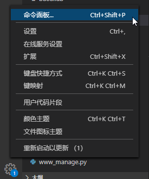
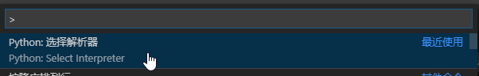
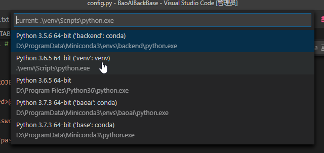

## BaoAI 前后端开发工具都采用 Visual Studio Code

## 安装插件：

`Chinese (Simplified) Language Pack for Visual Studio Code` ：中文语言包

`jshint` ：js语法检验

`Python` ：Python 语法检查, 调试 (包含远程调试), 智能感知, Jupyter Notebooks, 代码格式化, 代码重构, 单元测试, 代码片段等。

`Git history` ：Git日志管理

## BaoAI Front 前端项目

vscode默认已经支持HTML5、CSS和JS 语法检查, 调试 (包含远程调试), 智能感知, 代码格式化, 代码重构, 单元测试, 代码片段等。

js语法检验配置文件 .jshintrc （放在根目录）
```
{
  /**
   * 选择ES版本，3,5,6
   */
   "esversion": 5,
  /**
   * 不显示缺少分号警告
   */
  "asi": true,
  /**
   * 这个选项定义全局暴露的jQuery库。
   */
   "jquery": true,
  //
  // Environments
  //
  // These options let JSHint know about some pre-defined global variables.
  /**
   * 暴露浏览器属性的全局变量，列如 window,document;
  注意:这个选项不暴露变量 alert或 console。
   */
   "browser": true,
  /**
  *这个选项可以用来指定一个没有正式定义的全局变量的白名单。配置 globals在单个文件,看看内联配置.
  *需要的引用到的js类库的全局变量应该加入进来
  */
  "globals": {
    "localStorage": true,
    "app": true,
    "export": true,
    "console": true,
    "Messager": true,
    "CryptoJS": true,
    "WebUploader":true,
    "angular":true,
    "CKEDITOR":true,
    "moment":true,
    "echarts":true,
    "layer":true,
    "MENU":true,
    "NAV_MENU":true,
    "Pace":true
  }
}
```

## BaoAI Back 后端项目：

 项目根目录下创建venv目录，在该目录下创建python虚拟环境


<p></p>

<p></p>

<p>选择venv目录下的python解析器</p>

<p></p>

<p>&nbsp;</p>


